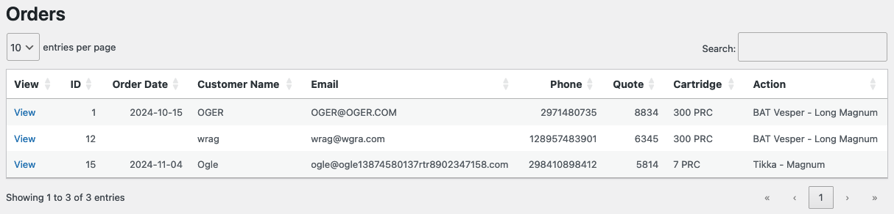

# Admin Panel Documentation
Upon logging in using *administrator* level credentials to the web backend, find the tab in the lefthand navigation menu titled `Custom Rifles`. This tab serves as the hub for all things "Custom Rifle Builder." 

There are three submenu tabs: `Custom Rifles`, `View Orders`, and `Parts`.

## Custom Rifles
The `Custom Rifles` tab provides a general overview of everything the plugin has to offer. A snapshot of recent orders is provided, along with two *action* buttons. Select `View All Orders` to be taken to the `View Orders` page, or `Edit Rifle Parts` to be taken to the `Parts` page.

The recent orders table on the home page does not have the same functionality as the *Orders* table in the `View Orders` page. As this table is simply a snapshot of the most recent orders, you will need to find that order again under the `View Orders` table in order to further inspect it.

## View Orders
The `View Orders` page provides a comprehensive list of all custom rifle orders. It utilizes the [DataTables.js](https://datatables.net/manual/) library to get quick and easy responsiveness. 

The table itself shows `10` entries per page by default, but can be configured to show more. Simply click the dropdown at the top left and select a higher number. Clicking on the title of each column will sort the table by that attribute. 

For example - clicking the `Email` column title once will sort the table in descending order based on email. Clicking the column title again will sort the table in ascending order based on email. Clicking it one more time will return the table to its default view (which is sorted in descending order based on the `ID` attribute).

Other pieces to be aware of: the `Search` bar in the top right of the table provides instant searching capabilites. As you type a word, the table will be automatically filtered to only include rows with the string you have input to the Search bar.

When you would like to see the full ticket for an order, click the `View` link on the far left of its table row. You will be taken to the `Order Details` page for that order.

## Order Details
The `Order Details` page provides every peice of information connected to a particular order. The `Order Details` page is currently still being developed. Documentation will be updated when the page has been finished.

## Rifle Parts
